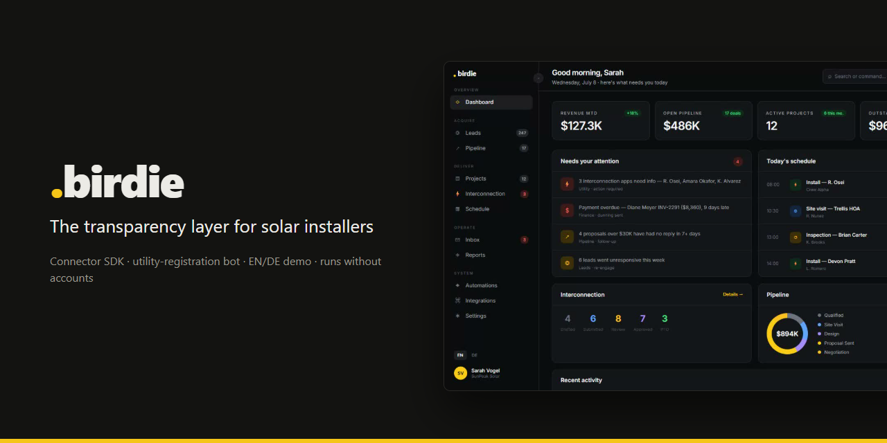
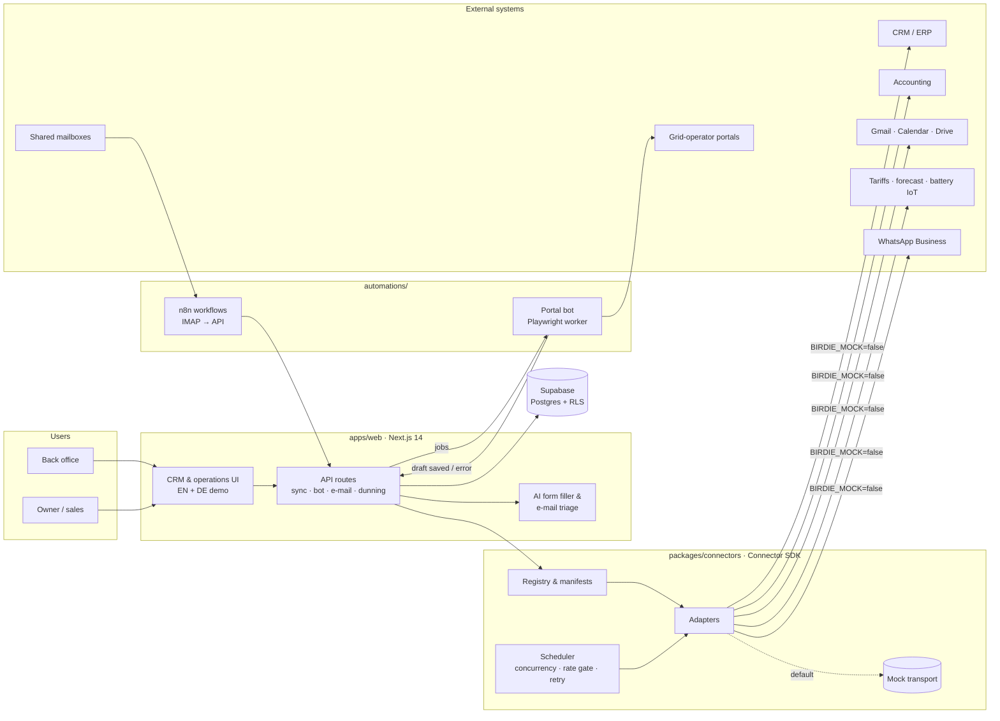

# .birdie — the transparency layer for solar installers

[](https://github.com/GodSmasher/birdie-platform/actions/workflows/ci.yml)

[](https://birdie-platform-nine.vercel.app/demo)

> **Status: Development paused pending funding; frontend demo and integration layer complete.**

**Live demo → [birdie-platform-nine.vercel.app/demo](https://birdie-platform-nine.vercel.app/demo)** · auf Deutsch: [/de/demo](https://birdie-platform-nine.vercel.app/de/demo)
No login. The hosted demo runs in mock mode with invented data only.


Or run it yourself in two commands — no accounts, no keys, no database:

```bash
npm install
npm run dev        # → http://localhost:3000/demo  (English)  ·  /de/demo  (Deutsch)
```

Everything in this repository runs in **mock mode by default**: the UI serves fake data, the connectors talk to a mock transport, and the portal bot processes sample jobs without opening a browser.

---

## The problem

A solar installer with 10–50 employees typically runs the business across a CRM, an accounting tool, shared mailboxes, a cloud drive, a calendar, inverter and battery vendor portals — and dozens of grid-operator web portals, each with its own login and its own PDF forms. None of these tools talk to each other.

The result is a back office that spends its day copying data between tabs:

- A utility asks a follow-up question by e-mail; nobody notices for a week, and the grid connection stalls.
- The same system data (kWp, inverter, storage, address) is typed into a new utility form for every single project.
- Invoices go overdue because accounting and project status live in different tools.
- The owner cannot answer "where does project X stand?" without asking three people.

## The solution

birdie does not replace those tools. It **connects** them and puts one clear picture on top:

- **One pipeline view** from lead to grid approval, fed by the tools the installer already uses.
- **Utility registration ("Netzanmeldung") on autopilot** — forms prefilled from project data, utility e-mails matched to the right project, portal drafts prepared by a bot and released by a human.
- **Automations for the boring parts** — dunning, delivery confirmations, document enrichment, e-mail triage.
- **A connector SDK** so every new integration is one small, testable adapter instead of a one-off script.

## Architecture



**Design decisions worth a look**

- **Transport injection.** Every connector receives its `fetch` through a context object. Production gets a resilient fetch (timeout, exponential backoff with jitter, `Retry-After`); mock mode gets a transport that answers with API-shaped fake data. The connector's real parsing and normalization code runs in both cases — see [`packages/connectors/src/context.ts`](packages/connectors/src/context.ts) and [`src/mock/fetch.ts`](packages/connectors/src/mock/fetch.ts).
- **Self-describing connectors.** Each adapter ships a manifest (auth type, config fields, capabilities, regions). The UI renders its connector catalog and setup forms from those manifests.
- **Human in the loop.** The portal bot never submits anything. It logs in, prefills the application, saves a draft, takes a screenshot and reports back; a person reviews and releases it.
- **Error isolation.** The scheduler fans out polling jobs with a concurrency limit and a per-connector rate gate; one failing installation never blocks the batch.
- **gettext-style i18n.** English source strings are the keys, German lives in per-page dictionaries, missing entries fall back to English ([`apps/web/app/demo/i18n`](apps/web/app/demo/i18n)).

## Repository layout

```
apps/web/                 Next.js app: marketing site, CRM demo (EN/DE), operations UI, API routes
packages/connectors/      Connector SDK: types, registry, scheduler, resilient HTTP, mock transport, adapters
automations/n8n/          n8n workflow exports (credentials and URLs are placeholders)
automations/portal-bot/   Playwright worker for grid-operator portals (mock driver included)
supabase/                 Database schema and migrations (schema only, no data)
```

## Connectors

All adapters implement the same two-method interface (`testConnection`, `pull`) and run against the mock transport out of the box.

| Connector | Category | Auth | What it pulls |
|---|---|---|---|
| Reonic | CRM / ERP | API token | Component catalog → DATANORM 4.0 export |
| sevDesk | Accounting | API token | Invoices, open / overdue / paid totals |
| Gmail | Communication | OAuth 2 | Inbox profile, unread count, latest messages |
| Google Calendar | Scheduling | OAuth 2 | Installation and site-visit events |
| Google Drive | Documents | OAuth 2 | Project folders, storage quota |
| WhatsApp Business | Communication | Cloud API token | Sender profile, approved templates |
| EcoFlow | Battery / IoT | Signed API key | Devices, state of charge, PV / AC / grid power |
| Tibber | Dynamic tariff | Token (GraphQL) | Current, today's and tomorrow's prices |
| aWATTar | Dynamic tariff | none | Day-ahead market prices (DE / AT) |
| Solcast | PV forecast | API key | Rooftop production forecast |
| OpenWeatherMap | Weather | API key | 5-day forecast, cloud cover |

Additional server-side integrations inside the web app: Supabase, Anthropic (document AI), Brevo (transactional e-mail), IMAP/SMTP, pCloud, and the German market master data register (MaStR).

```bash
npm run connectors                  # list all connectors
npm run connectors -- sevdesk       # run one connector (mock transport)
npm run connectors:poll             # fan-out polling demo: 21 jobs, concurrency 6
```

## Automations

| Automation | Where | What it does |
|---|---|---|
| Utility e-mail sync | `automations/n8n/utility-email-sync.json` | Polls shared mailboxes via IMAP, pushes messages to the API, which matches them to projects and drafts replies |
| Portal bot | `automations/portal-bot/` | Picks up registration jobs, logs into the grid-operator portal, prefills the application, saves a draft, reports back |
| AI document filler | `apps/web/app/lib/ai-form-filler.ts` | Maps project data onto arbitrary utility PDF forms with an LLM, with per-field human overrides |
| Deterministic form fillers | `apps/web/app/lib/*-fill.ts` | Hand-mapped field logic for high-volume utility forms |
| Dunning | `apps/web/app/lib/dunning-server.ts` | Staged payment reminders driven by invoice status |
| E-mail triage | `apps/web/app/lib/netz-email.ts` | Classifies utility mail (approval, follow-up question, meter appointment) and suggests the next step |

```bash
npm run portal-bot                  # one worker tick in mock mode: 2 drafts, 1 deliberate failure
```

The public repository ships a representative subset of portal drivers (one shared portal family and one standalone portal) plus the mock driver. The private implementation covers 18 German grid-operator portals end to end, with another 24 recognised and stubbed. Utility PDF templates are third-party documents and are not redistributed here — drop your own into `apps/web/nb-templates/` to use the form fillers.

## Tests

`npm test` runs the vitest suite across all workspaces (no network, mock transport only).
Covered: every connector against the mock transport, the polling scheduler, the DATANORM round trip, the portal bot's mock run, the demo i18n dictionaries and mock/demo mode detection. CI runs typecheck, tests and the production build on every push and pull request.

The walkthrough GIF above is generated with `npm run demo:record` (Playwright + ffmpeg, see `scripts/record-demo.mjs`).

## Tech stack

**Frontend** Next.js 14 (App Router) · React 18 · TypeScript · Tailwind CSS
**Backend** Next.js route handlers · Supabase (Postgres, row-level security) · pdf-lib · ImapFlow · Nodemailer
**Integration layer** TypeScript connector SDK · resilient fetch with backoff · polling scheduler
**Automation** n8n · Playwright · Docker
**AI** Anthropic Claude for document filling and e-mail classification

## Setup

Requirements: Node.js 20+.

```bash
git clone <this-repo> && cd birdie-platform
npm install
npm run dev
```

| URL | What you get |
|---|---|
| `/` | Marketing site (English) · `/de` German |
| `/demo` | CRM demo in English — switch language in the sidebar |
| `/de/demo` | CRM demo in German |
| `/dashboard`, `/netzanmeldung`, … | Operations UI on mock data |

**Connecting real services (optional).** Copy [`.env.example`](.env.example) to `apps/web/.env.local`, fill in the services you need and set `BIRDIE_MOCK=false`. Apply the schema in `supabase/` to a fresh Supabase project. Without `BIRDIE_MOCK=false` nothing in this repository makes an outbound API call.

```bash
npm run typecheck                   # all workspaces
```

## About the data

Every customer, address, phone number, e-mail address and invoice in this repository is invented. The fictional installer "SunPeak Solar" stands in for the tenant. The case study under `/case-studies/volta` describes a real pilot customer that has since ceased operations.

## License

All rights reserved. The code is published for portfolio and review purposes; "birdie" and the birdie logo are the author's brand.
